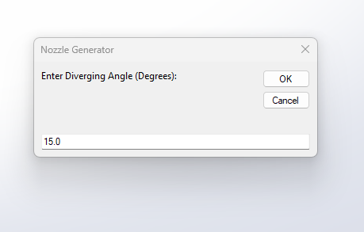
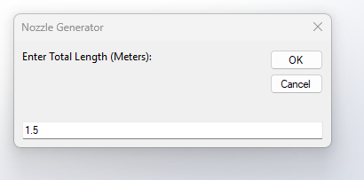
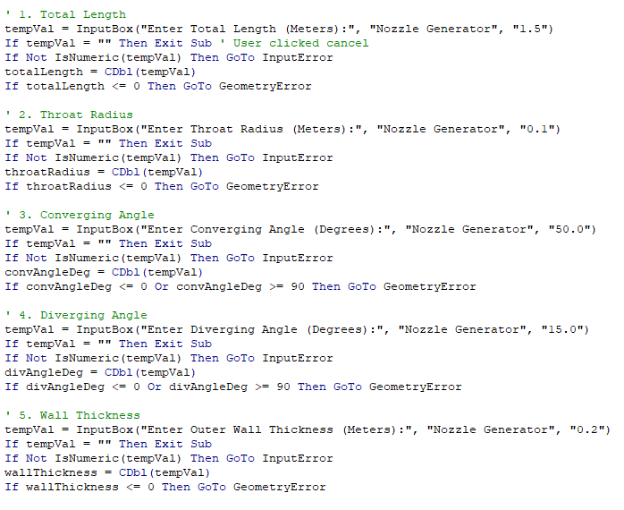
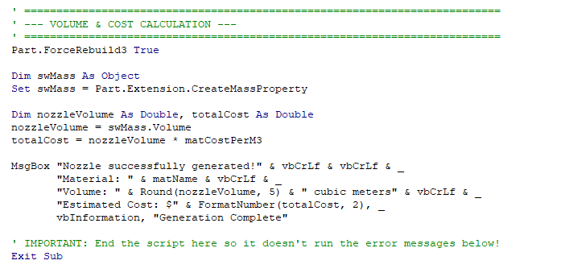
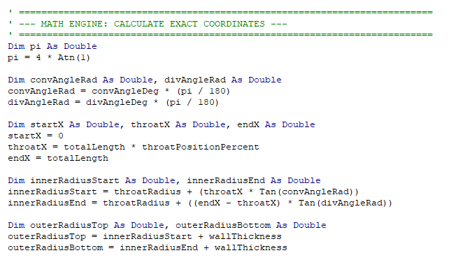
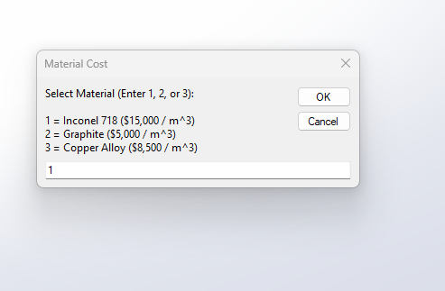
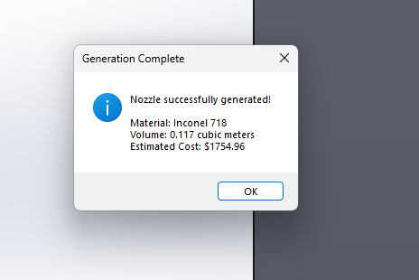
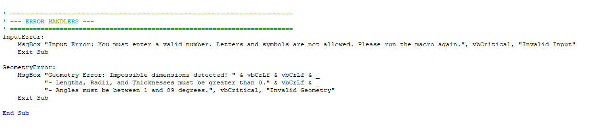
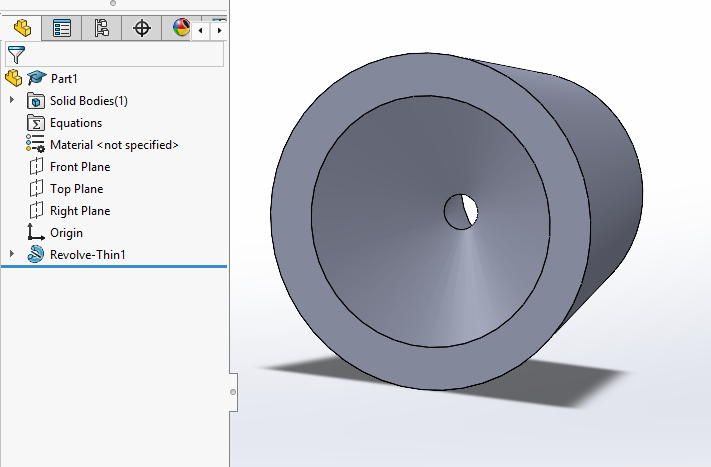

<h1 align="center">Hydrogen Propulsion Nozzle Automation</h1>

Automated converging-diverging nozzle generation workflow using SolidWorks API and VBA

CAD Automation • Hydrogen Propulsion • Parametric Design • Aerospace Engineering

---

## Overview

This project focuses on the development of an automated CAD generation workflow for hydrogen propulsion nozzle systems using SolidWorks API and VBA automation.

The system was designed to reduce repetitive engineering tasks by enabling rapid generation of converging-diverging nozzle geometries for aerospace propulsion applications.

The investigation focuses on:
- CAD automation workflows
- parametric nozzle generation
- propulsion system geometry
- engineering efficiency improvement
- automated modelling techniques
- aerospace design optimisation

---

## Technical Details

### Software Used
- SolidWorks
- VBA
- SolidWorks API
- MATLAB

### Engineering Methodology
- Parametric CAD modelling
- Automated geometry generation
- Engineering workflow optimisation
- API-based feature automation
- Propulsion nozzle configuration studies

### Key Engineering Areas
- Hydrogen Propulsion Systems
- Aerospace CAD Design
- Engineering Automation
- Parametric Modelling
- Nozzle Geometry Optimisation

---

## Workflow & Automation Process

### Initial Input Parameters

  

  

  <em>Initial engineering input parameters used for automated nozzle generation workflow.</em>

---

### Automation Code & Logic

  

  

  <em>SolidWorks API and VBA automation logic used for geometry creation and engineering workflow optimisation.</em>

---

### Mathematical Modelling

  

  <em>Mathematical formulation and engineering calculations supporting converging-diverging nozzle geometry generation.</em>

---

## CAD & BIM Results

### Generated BIM / CAD Outputs

  

  

  <em>Generated propulsion nozzle geometry and BIM-integrated CAD outputs produced through automated workflow execution.</em>

---

### Error Handling & Validation

  

  <em>Error handling and validation systems implemented to improve workflow robustness and engineering reliability.</em>

---

## Final Results

### Final Automated Nozzle Output

  

  <em>Final converging-diverging nozzle configuration generated using the automated CAD workflow system.</em>

---

## Results & Findings

The automation workflow successfully reduced manual CAD modelling effort while improving geometry consistency and accelerating propulsion system generation.

Key findings include:

- Faster propulsion nozzle modelling workflow
- Reduced repetitive CAD operations
- Improved engineering repeatability
- Automated parametric geometry control
- Improved workflow efficiency through API automation
- Enhanced engineering consistency and modelling accuracy

The project demonstrates the effectiveness of CAD automation methodologies within aerospace propulsion system design workflows.

---

## Future Improvements

Potential future developments include:
- CFD integration workflows
- thermal analysis integration
- AI-assisted geometry optimisation
- automated simulation pipelines
- cloud-based engineering automation

---

## Author

Varun Saini  
Aerospace Engineering Graduate  
Preston, United Kingdom
